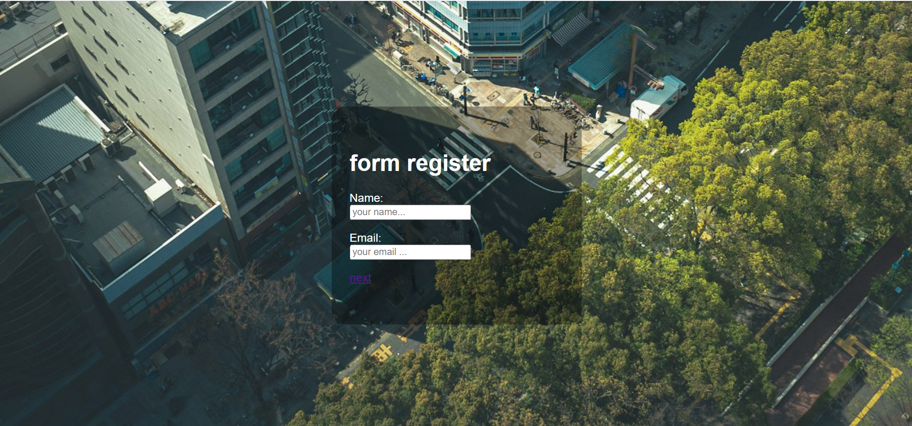
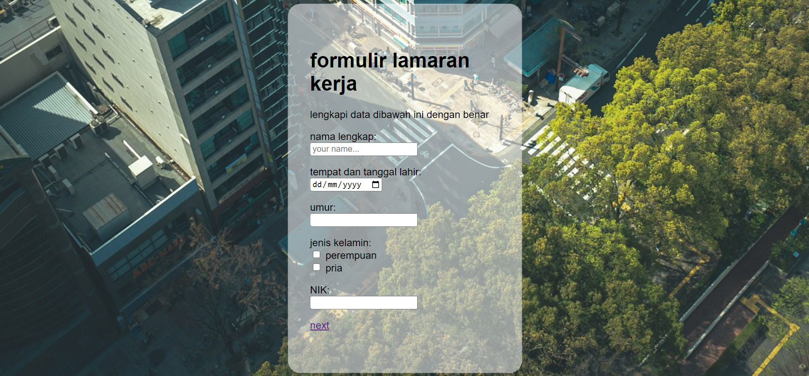

# Web Pengelolaan Data Elektronik

This project is a simple web-based eForm for electronic data management using Python and MySQL.  
It allows users to input, store, and manage data efficiently through a user-friendly web interface.

## Technologies Used
- Python  
- Flask  
- MySQL  
- HTML & CSS

## Screenshots  

### Main Page  

### Form Input  

### Submission Confirmation  

